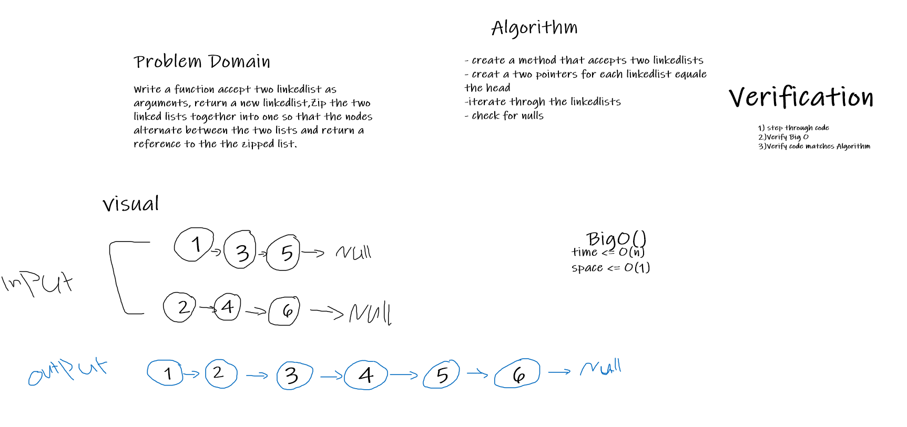

# Challenge Summary

Write a function accept two linkedlist as arguments, return a new linkedlist,
Zip the two linked lists together into one so that the nodes alternate between the two lists and return a reference to the the zipped list.

## Whiteboard Process

