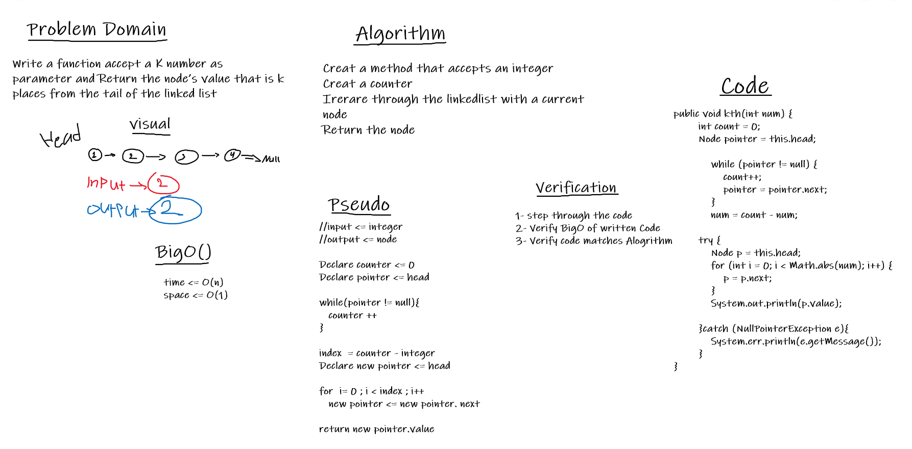

# Challenge Summary

## Zip

Write a function accept two linkedlist as arguments, return a new linkedlist,
Zip the two linked lists together into one so that the nodes alternate between the two lists and return a reference to the the zipped list.

## Zip Whiteboard Process

## KTH

Write a function accept a K number as parameter and Return the node’s value that is k places from the tail of the linked list

## KTH Whiteboard Process

