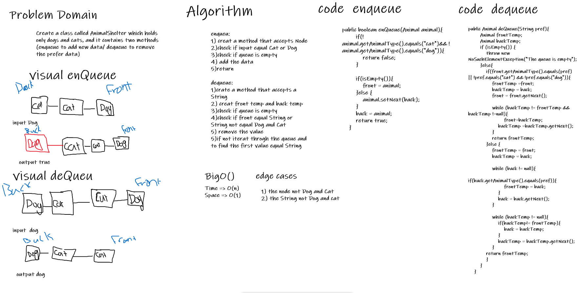

# Challenge Summary

Create a class called AnimalShelter which holds only dogs and cats,it's using a first-in, first-out approach.

## Whiteboard Process



## Approach & Efficiency

enqueu:

1. creat a method that accepts Node
2. check if input equal Cat or Dog
3. check if queue is empty
4. add the data
5. return

dequeue:

1. crate a method that accepts a String
2. creat front temp and back temp
3. check if queue is empty
4. check if front equal String or String not equal Dog and Cat
5. remove the value
6. if not iterat throgh the queue and to find the first value equal String

## Solution

to run the code

```Java
 animalShelter.enQueue(new Animal("pop","dog"));
```

```Java
 animalShelter.deQueue("cat");
```
