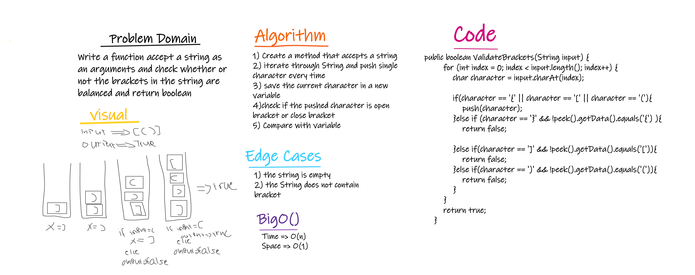

# Challenge Summary

Write a function accept a string as an arguments and check whether or not the brackets in the string are balanced and return boolean

## Whiteboard Process



## Approach & Efficiency

1. Create a method that accepts a string
2. iterate through String and push single character every time
3. save the current character in a new variable
4. check if the pushed character is open bracket or close bracket
5. Compare with variable

## Solution

to run the code:

```java
 public static void main(String[] args) {

        Stack validateBrackets = new Stack();

        try {
            System.out.println(validateBrackets.ValidateBrackets("{}(){}"));
        }catch (Exception e){
            System.err.println(e.getMessage());
        }


    }
```

the method:

```Java
 public boolean ValidateBrackets(String input) {
        for (int index = 0; index < input.length(); index++) {
            char character = input.charAt(index);

            if(character == '{' || character == '[' || character == '('){
                push(character);
            }else if (character == '}' && !peek().getData().equals('{') ){
                return false;

            }else if(character == ']' && !peek().getData().equals('[')){
                return false;
            }else if(character == ')' && !peek().getData().equals('(')){
                return false;
            }
        }
        return true;
    }
```
